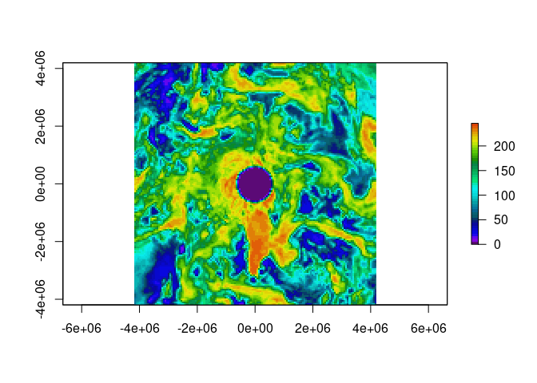
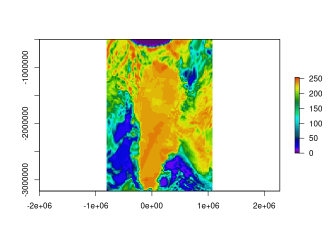

<!-- README.md is generated from README.Rmd. Please edit that file -->

[](https://travis-ci.org/hypertidy/lazyraster)
[](https://travis-ci.org/hypertidy/lazyraster)
[](https://ci.appveyor.com/project/mdsumner/lazyraster)
[](https://codecov.io/github/hypertidy/lazyraster?branch=master)
[](https://lifecycle.r-lib.org/articles/stages.html)
[](https://cran.r-project.org/package=lazyraster)
[](https://cran.r-project.org/package=lazyraster)

# lazyraster

The goal of lazyraster is to get raster data on demand at the right
resolution. This means that you can define a graphics device and then
stream just the right amount of pixels to fill it from a GDAL data
source.

## Installation

The package can be installed from Github.

``` r
## install.packages("remotes")
remotes::install_github("hypertidy/lazyraster")
```

See [vapour](https://github.com/hypertidy/vapour) for more on the
prerequisites.

## Details

There are functions `lazyraster()` to act like the `raster::raster()`
function and provide information but no data, and `crop()` to act like
`raster::crop()` and then `as_raster` to break the lazy chain and build
an actual raster object. The size of the currently open (or
latent-default) device is used as a reasonable size for the output grid,
but can be controlled by argument `dim`.

When the data is read `lazyraster` can specify the exact dimensions of
the output raster, and by default a reasonable guess at the number of
pixels required to fill the current device is used.

A variety of resampling algorithms are available (nearest neighbour is
the default, [see this list for
more](https://github.com/hypertidy/vapour/blob/master/R/raster-input.R#L9))
and will be applied to reduce or increase the resolution.

## Limitations

We can’t utilize the RasterIO level-of-detail functionality for non-GDAL
sources.

We can only access a single band.

We can’t control the details of the data type.

## GDAL

This uses a standard internal functionality of GDAL, the [RasterIO
function of the
GDALRasterBand](https://gdal.org/doxygen/classGDALRasterBand.html). This
is used in a lot of different software, and is obviously pretty robust
and well tested by the GDAL community, but I only really have experience
with one product (commercial, now defunct) that used it extensively for
live interactive visualization and data streaming. I haven’t found any
problems with it at all using it in R, but the support for it is very
minimal. You can access it indirectly using `rgdal::readGDAL` for the
underlying function, as the `raster` package does.

## vapour

To make this work we use the GDAL package
[vapour](https://github.com/hypertidy/vapour). All of the ease-of-use
code is in this package, `vapour` is pointedly bare-bones and provides
very little interpretation of a data source because it is designed for
use in development.

## Examples

Connect lazily to a GeoTIFF, see details of what’s there, crop to a
section and then read it in and plot.

This is not a huge file, but is easily accessible and demonstrates the
idea.

First we connect to a source and show two versions, the first is
information about the data in its native form (286 rows and 143
columns), and then an actual RasterLayer but at a very small requested
size (24 rows by 12 columns).

``` r
sstfile <- system.file("extdata/sst.tif", package = "vapour")
library(lazyraster)
#> 
#> Attaching package: 'lazyraster'
#> The following object is masked from 'package:graphics':
#> 
#>     plot
#> The following object is masked from 'package:base':
#> 
#>     plot
lazy <- lazyraster(sstfile)
lazy ## stay lazy
#> class         : LazyRaster
#> dimensions    : 286, 143 (nrow, ncol)
#> resolution    : 0.07000000, 0.07000389 (x, y)
#> extent        : 140.00000, 150.01000, -60.01833, -39.99722 (xmin, xmax, ymin, ymax)
#> crs           : <placeholder>
#> values        : NA, NA (min, max - range from entire extent)
#> window extent : <whole extent>
#> window index  : <->
## be only so lazy
as_raster(lazy, dim = c(12, 24))
#> class      : RasterLayer 
#> dimensions : 24, 12, 288  (nrow, ncol, ncell)
#> resolution : 0.8341667, 0.834213  (x, y)
#> extent     : 140, 150.01, -60.01833, -39.99722  (xmin, xmax, ymin, ymax)
#> crs        : NA 
#> source     : memory
#> names      : layer 
#> values     : -3.4e+38, 289.478  (min, max)
```

The call to `as_raster` read actual data from the file, hence the
difference between the range of data values reported first from the
whole extent, and then reported by raster itself for the resample data
read in.

Now let `lazyraster` make its own choice about the size of the output.
This will be based on the return value of `dev.size("px")`.

``` r
## note how we actually resample up because this data is not very large
as_raster(lazy)
#> class      : RasterLayer 
#> dimensions : 480, 672, 322560  (nrow, ncol, ncell)
#> resolution : 0.01489583, 0.04171065  (x, y)
#> extent     : 140, 150.01, -60.01833, -39.99722  (xmin, xmax, ymin, ymax)
#> crs        : NA 
#> source     : memory
#> names      : layer 
#> values     : -3.4e+38, 289.859  (min, max)
```

More concretely, if we open a graphics device at a given size the raster
data read in will match it. (This is not the best choice but works fine
for demonstration and experimenting.)

``` r
## what do we get if we set up a bitmap device
tf <- tempfile(fileext = "png")
png(tf, height = 50, width = 40)
as_raster(lazy)
#> class      : RasterLayer 
#> dimensions : 50, 40, 2000  (nrow, ncol, ncell)
#> resolution : 0.25025, 0.4004222  (x, y)
#> extent     : 140, 150.01, -60.01833, -39.99722  (xmin, xmax, ymin, ymax)
#> crs        : NA 
#> source     : memory
#> names      : layer 
#> values     : -3.4e+38, 289.815  (min, max)
#plot(as_raster(lazy))
dev.off()
#> png 
#>   2
unlink(tf)
```

This will work on really big files.

(This example can’t work on your computer probably given use of local
raadtools, but try it on your favourite big file).

This takes a fairly large grid and plots just enough detail by reading
just enough detail for the plot space. That’s all that happens.

``` r
library(raadtools)
#> Loading required package: raster
#> Loading required package: sp
#> global option 'raadfiles.data.roots' set:
#> '/rdsi/PRIVATE/raad/data               2021-06-10 21:27:17
#>  /rdsi/PRIVATE/raad/data_local         2021-06-10 21:33:25
#>  /rdsi/PRIVATE/raad/data_staging       2021-06-10 21:33:28
#>  /rdsi/PRIVATE/raad/data_deprecated    2021-06-10 21:34:11
#>  /rdsi/PUBLIC/raad/data                2021-06-10 21:13:58'
#> Uploading raad file cache as at 2021-10-08 00:30:58 (1105188 files listed)
f <- raadtools::topofile("gebco_14")
#> Warning in if (!file.exists(topopath)) warning(sprintf("cannot file %s", : the
#> condition has length > 1 and only the first element will be used
lazyraster(f)
#> class         : LazyRaster
#> dimensions    : 21600, 43200 (nrow, ncol)
#> resolution    : 0.008333333, 0.008333333 (x, y)
#> extent        : -180.0000,  180.0000,  -90.0000,   90.0000 (xmin, xmax, ymin, ymax)
#> crs           : <placeholder>
#> values        : NA, NA (min, max - range from entire extent)
#> window extent : <whole extent>
#> window index  : <->
library(raster)
op <- par(mar = rep(0, 4))
system.time({
  rworld <- lazyraster(f)
plot(rworld, col = grey(seq(0, 1, length = 100)), axes = FALSE, xlab = "", ylab = "", asp = "", legend = FALSE)
})
```


    #>    user  system elapsed 
    #>   0.850   0.236  21.328
    par(op)

Now, plot the same kind of image but zoom in on a region purposefully.
The resolution provided has adapted to the context asked for.

``` r
rtas <- crop(rworld, extent(143.4, 149, -44, -39.1))
plot(rtas, col = grey(seq(0, 1, length.out = 64)), zlim = c(0, 1550))
rbath <- as_raster(rtas)
rbath[rbath > 0] <- NA
contour(rbath, add = TRUE, levels = quantile(rbath, prob = seq(0, 1, length.out = 8)))
title("Tasmania topography + bathymetric contours, from Gebco 2014", cex.main = 0.85)
```


This is not just to plot big rasters, it’s potentially useful for
streaming gridded data to a device that is resizing the view port
interactively. We also use it to explore a data set for useability and
general coverage, and designing sensible resampling workflows for very
large data models.

``` r
## PLEASE take care with this url, it is a 11Gb GeoTIFF
## https://astrogeology.usgs.gov/search/map/Mars/Topography/HRSC_MOLA_Blend/Mars_HRSC_MOLA_BlendDEM_Global_200mp_v2
dangerurl <- "https://planetarymaps.usgs.gov/mosaic/Mars/HRSC_MOLA_Blend/Mars_HRSC_MOLA_BlendDEM_Global_200mp_v2.tif"
## note prefix with GDAL's URL indirection
mars <- lazyraster(file.path("/vsicurl", dangerurl))
mars
#> class         : LazyRaster
#> dimensions    : 53347, 106694 (nrow, ncol)
#> resolution    : 0.003374121, 0.003374121 (x, y)
#> extent        : -180.00000,  179.99845,  -89.99922,   90.00000 (xmin, xmax, ymin, ymax)
#> crs           : <placeholder>
#> values        : NA, NA (min, max - range from entire extent)
#> window extent : <whole extent>
#> window index  : <->
plot(mars, col = grey(seq(0, 1, length = 256)))
```


``` r
as_raster(mars)
#> class      : RasterLayer 
#> dimensions : 480, 672, 322560  (nrow, ncol, ncell)
#> resolution : 0.535712, 0.3749984  (x, y)
#> extent     : -180, 179.9984, -89.99922, 90  (xmin, xmax, ymin, ymax)
#> crs        : NA 
#> source     : memory
#> names      : layer 
#> values     : -7716, 20910  (min, max)
plot(crop(mars, raster::extent(-100, -30, -18, 5)), 
     col = grey(seq(0, 1, length = 256)))
```


We’ve successfully used it to plot a DEM of Australia from a 67 Gb ESRI
binary grid (ADF) supplied by GeoScience Australia in *a few minutes*
(the grid is more than 1e5 pixels each dimension, so I’m not having this
document build do the job but here’s a figure I prepared earlier).

``` r
gafile <- raadtools::topofile("ga_srtm")
ga <- lazyraster(gafile)
ga
plot(ga)
```


``` r
# Make a TMS source and read at the desired resolution. 
# More here: http://rpubs.com/cyclemumner/358029
# 

library(lazyraster)
gibs_xml <- function(date, level = 3) {
  date <- format(date, "%Y-%m-%d")
sprintf('<GDAL_WMS>
         <Service name="TMS">
         <ServerUrl>
         https://gibs.earthdata.nasa.gov/wmts/epsg3413/best/MODIS_Terra_CorrectedReflectance_TrueColor/default/%s/250m/${z}/${y}/${x}.jpg</ServerUrl>
         </Service>
         <DataWindow>
         <UpperLeftX>-4194304</UpperLeftX>
         <UpperLeftY>4194304</UpperLeftY>
         <LowerRightX>4194304</LowerRightX>
         <LowerRightY>-4194304</LowerRightY>
         <TileLevel>%i</TileLevel>
         <TileCountX>2</TileCountX>
         <TileCountY>2</TileCountY>
         <YOrigin>top</YOrigin>
         </DataWindow>
         <Projection>EPSG:3413</Projection>
         <BlockSizeX>512</BlockSizeX>
         <BlockSizeY>512</BlockSizeY>
         <BandsCount>3</BandsCount>
         </GDAL_WMS>
         ', date, level)
}

s <- gibs_xml(Sys.Date()-10)
gibs <- lazyraster(s)
r2 <- as_raster(gibs, dim = c(150, 150))
library(raster)
## run the same simplification but with a different resampling 
## method
plot(as_raster(gibs, dim = c(150, 150), resample = "CubicSpline"), col = head(palr::sstPal(64), 45))
#> Warning: 'palr::sstPal' is deprecated.
#> Use 'sst_pal' instead.
#> See help("Deprecated")
```



``` r
## run with a different extent
e <- extent(-806000, 1080000, -3200000, -500000)
plot(as_raster(crop(gibs, e), dim = c(150, 150), resample = "CubicSpline"), col = head(palr::sstPal(64), 45))
#> Warning: 'palr::sstPal' is deprecated.
#> Use 'sst_pal' instead.
#> See help("Deprecated")
```



Please note that this project is released with a [Contributor Code of
Conduct](https://github.com/hypertidy/lazyraster/blob/master/CODE_OF_CONDUCT.md).
By participating in this project you agree to abide by its terms.
